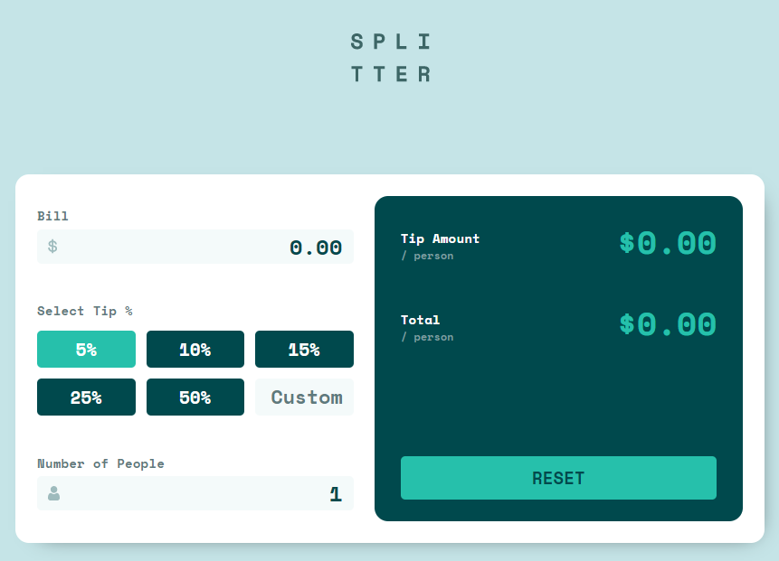

# Frontend Mentor - Tip calculator app solution 🏅

This project was bootstrapped with [Create React App](https://github.com/facebook/create-react-app).

This is a solution to the [Tip calculator app challenge on Frontend Mentor](https://www.frontendmentor.io/challenges/tip-calculator-app-ugJNGbJUX).

- Solution URL: [https://github.com/arthurvmdantas/tip-calculator](https://github.com/arthurvmdantas/tip-calculator)
- Live Site URL: [https://arthurvmdantas.github.io/tip-calculator](https://arthurvmdantas.github.io/tip-calculator)

## My process ⚙️
I wrote a blog post about tools, stack, challenges and lessons.

You can find it here: [https://arthurvmdantas.work/journal/journal-2021-08-31/](https://arthurvmdantas.work/journal/journal-2021-08-31/)

## Author 👨‍💻

- Website - [https://arthurvmdantas.work](https://arthurvmdantas.work)
- Frontend Mentor - [@arthurvmdantas](https://www.frontendmentor.io/profile/arthurvmdantas)
- Twitter - [@arthurvmdantas](https://www.twitter.com/arthurvmdantas)
